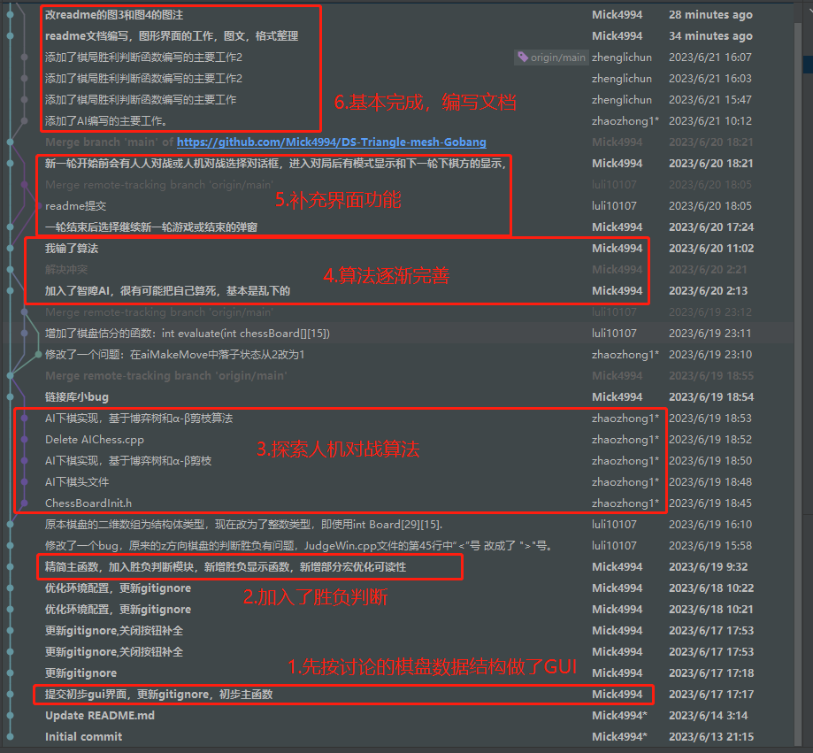

# - DS-Triangle-mesh-Gobang  （数据结构三角网格五子棋大作业）
This is the homework of Data Structure lesson

## 总分工:

### 组长--许咏琪（项目管理，代码运维，界面设计，文档整理）：

1. 界面功能的实现和测试检查整体工程，并进行界面逻辑处理
2. 修复测试员反馈的bug，重新提交仓库
3. 代码合并，运营管理整个代码仓库，处理分支冲突与合并
4. 分配任务，协调实现师之间的工作，共享变量的协调管理
5. 文档的整理编写，排版规划
6. 重大事项或关键更改的决定权

- 界面处理:
  - 开始前：选择界面（选人人对战或人机对战） 
  - 对战时：棋盘绘制，落子反馈，胜负监听，状态显示

### 实现师--陈海龙（棋盘数据结构初始化，上游数据处理，人机算法研究，算法文档编写）
1. 做建棋盘和映射部分:
无输入，因为是整个主函数的初始化部分
处理：建立一个初始化二维数组的棋盘（即盘上没有任何棋子的状态），类型是指导书里的节点
节点状态和位置初始化看底下共享变量的解释
输出：初始化的五子棋节点类型的二维数组棋盘
2. 研究并编写五元组对战算法

### 实现师--郑丽纯（胜负判断，中游数据处理，棋盘状态处理，算法文档编写）
做胜负判断的函数：
输入：当前二维数组的棋盘（类型是指导书里的节点）
处理：判断当前胜负情况
输出：一个整数，0为继续，1为白胜，2为黑胜

### 实现师--姚中正（人机对战逻辑，下游数据处理，回溯树研究，算法文档编写）
做机器人下棋函数：
输入：当前二维数组的棋盘（类型是指导书里的节点）
处理：根据当前棋盘状态（当前的二维数组（传入引用））计算最优落点。
输出：电脑下一步落子位置（标记在棋盘上）。

### 测试员--吴俊壕（测试并反馈bug给组长和其他实现师）：
做运行测试函数，以胜负变量为循环条件，选择继续或对战，弹窗条件判断，函数入口判断，测试调用各个流程的算法

### PPT制作--李德军（参与制作汇报PPT）

### 共享变量：

二维五子棋棋盘，全局模式，全局胜负变量

### 开发日志流程图:

 
 
图（git仓库的所有commit）

---
## 工作内容：

>工作内容分为算法和图形界面

## 图形界面主要工作：
全程使用EasyX库，加上部分Windows开发
### 1. 棋盘绘制:
- `./src/ChessBoardUI.cpp`文件的`LoadChessBoardUI`函数初始化棋盘函数，
传入初始化的棋盘类和是否为人机模式（布尔类型）， 按棋盘的数据结构布置落子监听，
并在其中绘制关闭按钮供退出程序，并调用`DrawMode`函数绘制对战方（AI或人）
函数无返回值。实现的效果为加载完棋盘主窗口和落子检测（如图1）  

 
 
图1（棋盘主窗口，其中黑点为落子处）

### 2. 监听反馈:
- 调用`./src/ChessBoardUI.cpp`中的`ChessDotAction`函数作为监听棋盘界面的反馈，当鼠标
按下对应合法落子位置时，触发该反馈，按照当前状态棋盘绘制落白子还是黑子或是否可落子
（当前位置上是否已经有子），
### 3. 状态显示:
- 在进入点击反馈后会调用`DropWhoDrop`函数绘制下一轮的下棋方（如图2右上角所示），同时会绘制棋盘状态
对接后端胜负判断的状态，在前端调用`DrwaRes`函数绘制继续或者白胜，黑胜（如图2左上角所示）  

 
 
图2（游玩状态显示）

### 4. 消息弹窗:
- 在进入游戏之前，会有一个模式选择，这个模式选择是用Windows消息框弹窗机制实现的，其调用了`MessageBox`函数属于Windows开发范畴， 
然后根据提示选择人机对战还是人人对战（如图3所示）
- 然后在有一方赢得胜利后，程序会再次弹窗，提示是否进行新一轮游戏（如下图4所示）  

 
 
图3（游玩模式选择）  

 
 
图4（结束选择弹窗）  

___

## 算法主要工作：
1. 设置了棋盘初始状态时的可落子的点，也给出了二维数组下标与xyz坐标之间的转换
    棋盘是一个`29*15`的二维数组，但是实际棋盘的形状是正六边形的，所以需要设置好棋盘可落子的点，可落子的点初始状态设置为0，否则为-1。
    根据规律找出棋盘的点：
    1. 0行到7行，列的循环条件为`for (int cel = 7 - row; cel <= 7 + row; cel += 2)`；
    2. 8行到21行： 列的循环条件为`for (int cel = (row + 1) % 2; cel <= 14; cel += 2)`；
    3. 22行到28行： 列的循环条件为`for (int cel = row - 21; cel <= 35 - row; cel += 2)`。
   
    #### 二维数组下标与xyz坐标之间的转换在`BoardEvaluate.cpp`文件里体现。

### 2. 编写了对棋盘进行估分的函数 （BoardEvaluate.cpp文件）

>首先定义五元组：六边形棋盘任意方向上连续相连的五个点称为五元组。对于整个棋盘的估分的思路就是把棋盘上所有五元组的估分加起来。
对于五元组的估分，设置如下：
   1. 同时含有黑子和白子，**得0分**;
   2. 含有1个子和4个空点，**得1分**;
   3. 含有2个子和3个空点，**得10分**;
   4. 含有3个子和2个空点，**得100分**;
   5. 含有4个子和1个空点，**得10000分**;
   6. 含有5个子，得1000000分
   7. 特殊情况，形如“0BBB0”，得2000分（B为黑子，0为无落子）
---
对于五元组估分函数，传参为棋盘和棋子的颜色，当五元组的元素与传入的棋子颜色不同时会返回0分。 
我把五元组的每个元素的状态划分为0和其他这两种状态，所以一个五元组共有`2^5 = 32`种可能， 
使用哈夫曼树的思想，对32种可能事先进行编码计算，并存入一个长度为32的估分数组中，根据数组下标返回得分。
> 解码时，遍历一遍五元组的元素，使用满二叉树的性质5，设置一个变量数值为1，当遍历到的元素为0时，往左子树走，数值*x2；否则往右子树走（如果棋子颜色不同直接返回0），数值*x2+1。
遍历完成后，数值减去32即可得到估分数组的下标。这样就可以达到只遍历一遍五元组就可以返回得分的目的，算法时间复杂度达到了最小。

### 3. 对于整个棋盘的估分函数：

运用到了循环队列的思想，设定3个长度为6的数组作为3个方向上的五元组的存储队列，数组的最后一个元素为队列起始位置的下标，前五个元素存储五元组的元素。

### 4. 编写了AI下棋函数(AIChess)
   运用了博弈树和α-β剪枝极大极小搜索算法，通过修改深度n，来实现走一步，看n步的AI。
   算法具体流程如下：
   >在aiMakeMove函数中，ai会对棋盘进行遍历，每次遍历会下一步棋并进行极大极小搜索来计算该点的最大收益。
   当达到算法规定递归深度时，叶子节点通过估分函数计算出该棋盘下的分数，并回溯给双亲节点。
   在极大极小搜索中，max层的α取孩子最大值，min层的β取孩子最小值，即max层只会修改α，min层只会修改β。双亲节点会将自己的α和β传递给孩子。当α>β时，则认为该分支下不再有更有解，进行剪枝。
   最后AI会记录下棋盘上某个最高分的点在该点并落子。

### 5. 编写了棋局胜利判断的一些函数(JudgeWin.cpp)
- JudgeWin.h 和JudgeWin.cpp文件中定义了一些函数和常量，用于判断六边形棋盘上是否有一方达到了五子连珠的条件，以获得游戏的胜利。
- 为了判断五子连珠，需要考虑六边形棋盘上的三个方向：x方向（水平），y方向（左上到右下），z方向（右上到左下）。 
- 对于每个方向，需要找出落子所在的线的编号，以及该线上的遍历起点坐标和遍历长度。这些信息可以通过一些数学公式或规律来计算。
- 然后，对于每个方向上的线，从起点开始遍历每个点，记录当前连续相同颜色棋子的个数。如果遇到不同颜色或空点，则清零计数器。如果计数器达到5，则说明有一方获胜，返回该颜色。
- 如果三个方向都没有达到五子连珠，则返回0，表示继续游戏。

在`JudgeWin.cpp`文件中：
- 包含`JudgeWin.h`文件和`ChessBoardUI.h`文件。
- 定义一个函数`getLine_x`来根据落子坐标计算x方向上的线编号，返回值为`cel`（列号）。
- 定义一个函数`getLine_y`来根据落子坐标计算y方向上的线编号，返回值为`(row + cel - 7) / 2`（行号加列号减7再除以2）。
- 定义一个函数`getLine_z`来根据落子坐标计算z方向上的线编号，返回值为`abs(row - cel + 7) / 2`（行号减列号加7再取绝对值再除以2）。
- 定义一个函数`JudgeWin`来判断落子方是否胜利，参数为棋盘和落子坐标，返回值为游戏状态：
    - 调用`getLine_x`，`getLine_y`，`getLine_z`函数来获取x，y，z方向上的线编号，并分别赋值给`Line_x`，`Line_y`，`Line_z`变量。
    - 根据线编号和一些规律来计算x，y，z方向上的遍历起点坐标和遍历长度，并分别赋值给`start_row_x`，`start_cel_x，len_x`等变量。
    - 获取当前落子的颜色，并赋值给color变量。
    - 对于每个方向：
        - 初始化一个计数器`max_x`等变量为0。
        - 用一个循环来遍历该方向上的线上的每个点：
            - 获取当前点的颜色，并赋值给cur_color变量。
            - 如果`cur_color`与`color`相同，则计数器加一。
            - 如果`cur_color`与color不同或为空，则计数器归零。
            - 如果计数器达到5，则返回`color`。
    - 如果三个方向都没有返回`color`，则返回0。
- 定义一个函数`PrintJudgeWin`来打印胜负结果，参数为棋盘和落子坐标，引用传递一个`res`变量来存储游戏状态：
    - 调用JudgeWin函数来获取游戏状态，并赋值给res变量。
    - 如果res为`CONTINUE`，则判断棋盘是否已满，如果是，则打印"Drawn game"，并调用`StopGame`函数；如果不是，则打印"Continue"。
    - 如果res为`WHITE_WIN`，则打印"White win"，并调用StopGame函数。
    - 如果res为`BLACK_WIN`，则打印"Black win"，并调用StopGame函数。
    - 调用DrawRes函数来在UI上显示胜负结果。
- 定义一个函数`StopGame`来停止游戏，并将棋盘上所有点的状态设为-1，参数为棋盘：
    - 用两个循环来遍历棋盘上的每个点，将其状态设为-1。
    - 将`ChessBoard`类的静态成员变量end设为true，表示游戏结束。

___

## 环境配置：

该项目用集成开发环境CLion开发，EasyX静态链接，所以只需要Windows10，11的平台的MinGW编译器即可

> 1. 在Windows平台下，下载安装git和CLion，推荐同时下载Github-Desktop方便推拉
> 2. 在磁盘适当位置（文件路径不要有中文）打开控制台（或git bash）运行`git clone https://github.com/Mick4994/DS-Triangle-mesh-Gobang`
> 3. 在该克隆的工程的git目录下为工作目录，右键文件资源管理器空白处用CLion打开为项目
> 4. 构建CMake项目，设置目标启动项即可运行