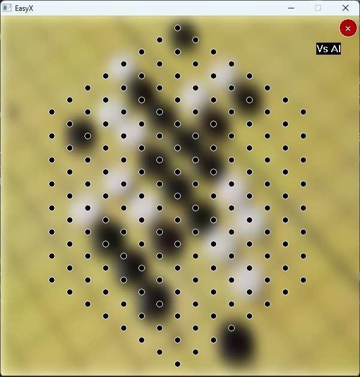
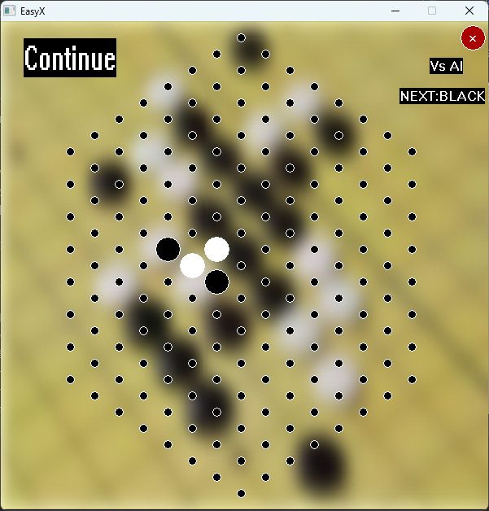
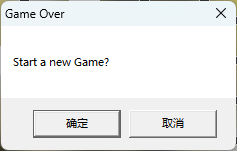

# - DS-Triangle-mesh-Gobang （数据结构三角网格五子棋大作业）
This is the homework of Data Structure lesson

>工作内容分为算法和图形界面

## 图形界面主要工作：
全程使用EasyX库，加上部分Windows开发
### 1. 棋盘绘制:
- `./src/ChessBoardUI.cpp`文件的`LoadChessBoardUI`函数初始化棋盘函数，
传入初始化的棋盘类和是否为人机模式（布尔类型）， 按棋盘的数据结构布置落子监听，
并在其中绘制关闭按钮供退出程序，并调用`DrawMode`函数绘制对战方（AI或人）
函数无返回值。实现的效果为加载完棋盘主窗口和落子检测（如图1）  

 
 
图1（棋盘主窗口，其中黑点为落子处）

### 2. 监听反馈:
- 调用`./src/ChessBoardUI.cpp`中的`ChessDotAction`函数作为监听棋盘界面的反馈，当鼠标
按下对应合法落子位置时，触发该反馈，按照当前状态棋盘绘制落白子还是黑子或是否可落子
（当前位置上是否已经有子），
### 3. 状态显示:
- 在进入点击反馈后会调用`DropWhoDrop`函数绘制下一轮的下棋方（如图2右上角所示），同时会绘制棋盘状态
对接后端胜负判断的状态，在前端调用`DrwaRes`函数绘制继续或者白胜，黑胜（如图2左上角所示）  

 
 
图2（游玩状态显示）

### 4. 消息弹窗:
- 在进入游戏之前，会有一个模式选择，这个模式选择是用Windows消息框弹窗机制实现的，其调用了`MessageBox`函数属于Windows开发范畴， 
然后根据提示选择人机对战还是人人对战（如图3所示）
- 然后在有一方赢得胜利后，程序会再次弹窗，提示是否进行新一轮游戏（如下图4所示）  

 
 
图3（游玩模式选择）  

 
 
图4（结束选择弹窗）  

___

## 算法主要工作：
1. 设置了棋盘初始状态时的可落子的点，也给出了二维数组下标与xyz坐标之间的转换
    棋盘是一个`29*15`的二维数组，但是实际棋盘的形状是正六边形的，所以需要设置好棋盘可落子的点，可落子的点初始状态设置为0，否则为-1。
    根据规律找出棋盘的点：
    1. 0行到7行，列的循环条件为`for (int cel = 7 - row; cel <= 7 + row; cel += 2)`；
    2. 8行到21行： 列的循环条件为`for (int cel = (row + 1) % 2; cel <= 14; cel += 2)`；
    3. 22行到28行： 列的循环条件为`for (int cel = row - 21; cel <= 35 - row; cel += 2)`。
   
    #### 二维数组下标与xyz坐标之间的转换在`BoardEvaluate.cpp`文件里体现。

### 2. 编写了对棋盘进行估分的函数 （BoardEvaluate.cpp文件）

>首先定义五元组：六边形棋盘任意方向上连续相连的五个点称为五元组。对于整个棋盘的估分的思路就是把棋盘上所有五元组的估分加起来。
对于五元组的估分，设置如下：
   1. 同时含有黑子和白子，**得0分**;
   2. 含有1个子和4个空点，**得1分**;
   3. 含有2个子和3个空点，**得10分**;
   4. 含有3个子和2个空点，**得100分**;
   5. 含有4个子和1个空点，**得10000分**;
   6. 含有5个子，得1000000分
   7. 特殊情况，形如“0BBB0”，得2000分（B为黑子，0为无落子）
---
对于五元组估分函数，传参为棋盘和棋子的颜色，当五元组的元素与传入的棋子颜色不同时会返回0分。 
我把五元组的每个元素的状态划分为0和其他这两种状态，所以一个五元组共有`2^5 = 32`种可能， 
使用哈夫曼树的思想，对32种可能事先进行编码计算，并存入一个长度为32的估分数组中，根据数组下标返回得分。
> 解码时，遍历一遍五元组的元素，使用满二叉树的性质5，设置一个变量数值为1，当遍历到的元素为0时，往左子树走，数值*x2；否则往右子树走（如果棋子颜色不同直接返回0），数值*x2+1。
遍历完成后，数值减去32即可得到估分数组的下标。这样就可以达到只遍历一遍五元组就可以返回得分的目的，算法时间复杂度达到了最小。

### 3. 对于整个棋盘的估分函数：

运用到了循环队列的思想，设定3个长度为6的数组作为3个方向上的五元组的存储队列，数组的最后一个元素为队列起始位置的下标，前五个元素存储五元组的元素。

___

## 环境配置：

用集成开发环境CLion开发，EasyX静态链接，所以只需要Windows10，11的平台的MinGW编译器即可

> 1. 在Windows平台下下载安装git和CLion，推荐同时下载Github-Desktop
> 2. 在磁盘适当位置（文件路径不要有中文）打开控制台（或git bash）运行`git clone https://github.com/Mick4994/DS-Triangle-mesh-Gobang`
> 3. 在该克隆的工程的git目录下为工作目录，右键文件资源管理器空白处用CLion打开为项目
> 4. 构建CMake项目，设置目标启动项即可运行